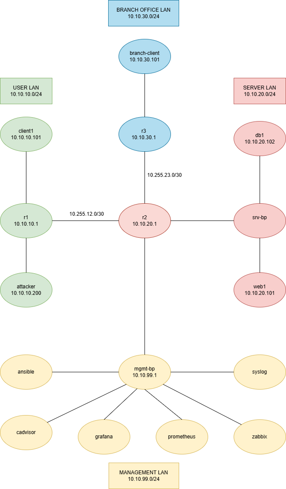

			Tehtävä Viikko 1

1. Johdanto

-Ympäristön tarkoituksena on sisältää verkon fyysinen ja looginen dokumentointi, mahdollistaa verkon tehokas
ylläpito, kehittäminen, valvonta ja vianratkaisu. 

-Topologian kartoitus:

r1			- reitittää liikennettä client1- ja attacker-verkoista eteenpäin	
r2			- reitittää liikennettä r1- ja r3-reitittimille, serverille ja mgmt-bridgelle
r3			- reitittää liikennettä r2-reitittimelle ja branch-clientille
client1			- käyttää verkkoa asiakkaana/itsenäisenä toimijana
attacker		- yrittää käyttää verkon heikkouksia omiin tarkoitusperiinsä
web1			- oletettavasti web-palvelin
db1			- tietokantapalvelin
branch-client		- käyttää verkkoa asiakkaana/itsenäisenä toimijana
ansible			- automaatio-työkalu verkonhallintaan
prometheus		- ohjelma verkon hallintaan ja valvontaan
grafana			- näyttää visuaalisesti verkon hallintaan ja valvontaan liittyvää metriikkaa
zabbix			- ohjelma verkon hallintaan ja valvontaan

2. Verkkokaavio

				

3. Laiteluettelo

r1		reititin
r2		reititin	
r3		reititin
client1		päätelaite
attacker	päätelaite
branch-client	päätelaite
web1		palvelin
db1		palvelin	
srv-bp		kontti (?)
mgmt-bp		kontti (?)
ansible		kontti
cadvisor	kontti	
grafana		kontti
prometheus	kontti
zabbix		kontti
syslog		kontti

4. IP-suunnitelma

Verkko			Tarkoitus				Yhdyskäytävä

10.10.10.0/24		Käyttäjien LAN				10.10.10.1/24

10.10.20.0/24		Palvelin LAN				10.10.20.1/24

10.10.30.0/24		Toimisto LAN				10.10.30.1/24

10.10.99.0/24		Hallinta LAN				10.10.99.1/24

10.255.12.0/30		r1 ja r2 välinen verkko			-------------

10.255.23.0/30		r2 ja r3 välinen verkko			-------------

Käyttäjien LANissa on r1-reititin ja client1 ja attacker päätelaitteet.
Palvelin LANissa on r2-reititin, palvelin, web-palvelin ja tietokantapalvelin.
Toimisto LANissa on r3-reititin ja branch-client-päätelaite.
Hallinta LANissa on kuusi verkonhallintaan tarkoitettua konttia ohjelmineen.

5. Reitityksen analyysi

root@client1:/# ip addr
1: lo: <LOOPBACK,UP,LOWER_UP> mtu 65536 qdisc noqueue state UNKNOWN group default qlen 1000
    link/loopback 00:00:00:00:00:00 brd 00:00:00:00:00:00
    inet 127.0.0.1/8 scope host lo
       valid_lft forever preferred_lft forever
    inet6 ::1/128 scope host
       valid_lft forever preferred_lft forever
632: eth0@if633: <BROADCAST,MULTICAST,UP,LOWER_UP> mtu 1500 qdisc noqueue state UP group default
    link/ether 02:42:ac:14:14:06 brd ff:ff:ff:ff:ff:ff link-netnsid 0
    inet 172.20.20.6/24 brd 172.20.20.255 scope global eth0
       valid_lft forever preferred_lft forever
    inet6 fe80::42:acff:fe14:1406/64 scope link
       valid_lft forever preferred_lft forever
652: eth1@if653: <BROADCAST,MULTICAST,UP,LOWER_UP> mtu 9500 qdisc noqueue state UP group default
    link/ether aa:c1:ab:b5:4f:a2 brd ff:ff:ff:ff:ff:ff link-netnsid 1
    altname clab-o-05031180f95d8850
    inet 10.10.10.101/24 scope global eth1
       valid_lft forever preferred_lft forever
    inet6 fe80::a8c1:abff:feb5:4fa2/64 scope link
       valid_lft forever preferred_lft forever
root@client1:/# ip route
default via 10.10.10.1 dev eth1
10.10.10.0/24 dev eth1 proto kernel scope link src 10.10.10.101
172.20.20.0/24 dev eth0 proto kernel scope link src 172.20.20.6
root@client1:/# ping -c 4 10.10.20.101
PING 10.10.20.101 (10.10.20.101) 56(84) bytes of data.
64 bytes from 10.10.20.101: icmp_seq=1 ttl=62 time=1.28 ms
64 bytes from 10.10.20.101: icmp_seq=2 ttl=62 time=0.122 ms
64 bytes from 10.10.20.101: icmp_seq=3 ttl=62 time=0.123 ms
64 bytes from 10.10.20.101: icmp_seq=4 ttl=62 time=0.194 ms

--- 10.10.20.101 ping statistics ---
4 packets transmitted, 4 received, 0% packet loss, time 3051ms
rtt min/avg/max/mdev = 0.122/0.428/1.275/0.489 ms
root@client1:/# ping -c 4 10.10.30.101
PING 10.10.30.101 (10.10.30.101) 56(84) bytes of data.
64 bytes from 10.10.30.101: icmp_seq=1 ttl=61 time=0.699 ms
64 bytes from 10.10.30.101: icmp_seq=2 ttl=61 time=0.093 ms
64 bytes from 10.10.30.101: icmp_seq=3 ttl=61 time=0.110 ms
64 bytes from 10.10.30.101: icmp_seq=4 ttl=61 time=0.491 ms

--- 10.10.30.101 ping statistics ---
4 packets transmitted, 4 received, 0% packet loss, time 3049ms
rtt min/avg/max/mdev = 0.093/0.348/0.699/0.257 ms
root@client1:/# traceroute 10.10.30.101
traceroute to 10.10.30.101 (10.10.30.101), 30 hops max, 60 byte packets
 1  10.10.10.1 (10.10.10.1)  0.389 ms  0.024 ms  0.009 ms
 2  10.255.12.2 (10.255.12.2)  0.091 ms  0.014 ms  0.014 ms
 3  10.255.23.2 (10.255.23.2)  0.157 ms  0.018 ms  0.021 ms
 4  10.10.30.101 (10.10.30.101)  0.072 ms  0.024 ms  0.022 ms

Yhteys kaikkiin verkkoihin löytyy. 

Liikenne kulkee client1 -> r1 -> r2 -> r3 -> branch-client.

6. Yhteenveto

Tilanteisiin ja tarpeisiin soveltuvien komentojen selvittäminen kulutti paljon aikaa. Heti kun tehtävänannoista ja 
materiaaleista ei löytynyt sopivia komentoja meinasi mennä sormi suuhun. Myös kokonaisuuden hahmottaminen aluksi,
kaikkien tarvittavien osasten yhdistäminen ja ympäristön käyttöönotto veivät eniten aikaa.

Dokumentaatio auttaa palvelusta vastaavaa it-asiantuntijaa työssään listaamalla verkon laitteet, verkot, aliverkot,
IP-osoitteet, yhdyskäytävät ja verkon topologian yhdeksi helposti analysoitavaksi ja ymmärrettäväksi kokonaisuudeksi.
