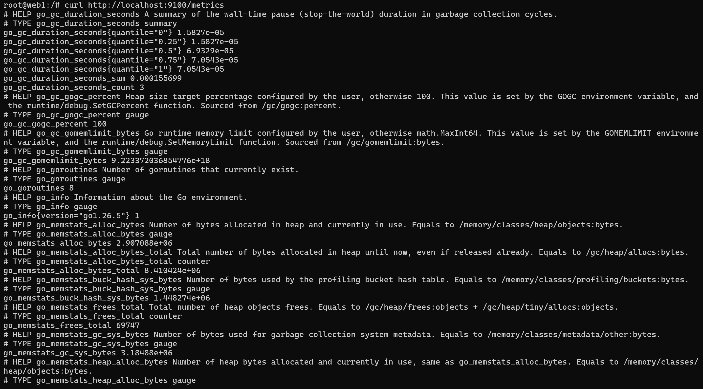
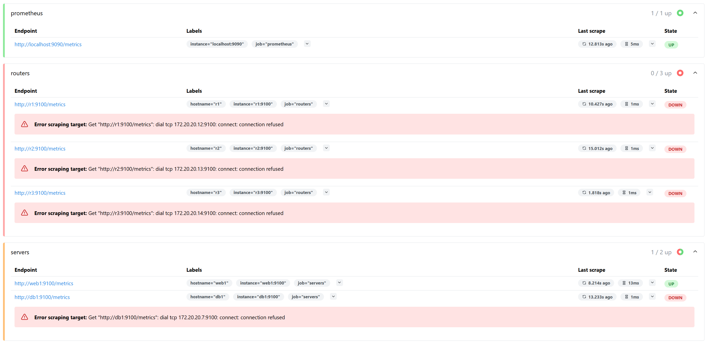
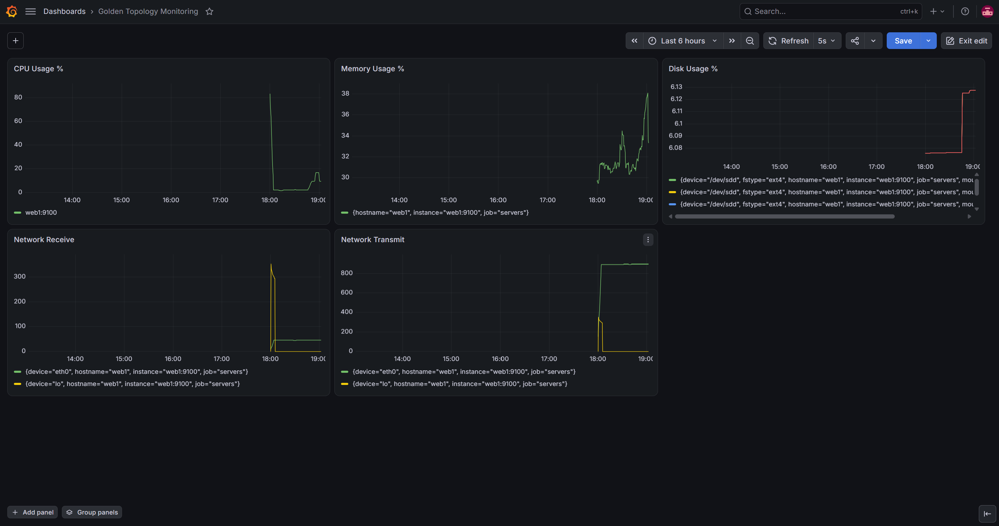

			Viikko 3

1. Johdanto

Prometheus on moderni monitorointiratkaisu. Tämän viikon harjoituksessa käytettiin Prometheus-järjestelmää ja 
Node Exporter-agenttia palvelimen valvontaan. Palvelimelta kerättiin suorituskykytietoja, kuten CPU:n käyttöä,
muistia, levytilaa ja verkkoliikennettä. 

2. Node Exporterin käyttöönotto

Ensimmäisenä kirjauduin web1-koneelle komennolla: docker exec -it clab-hamk-verkonhallinta-golden-web1 bash
Sen jälkeen asensin tarvittavat työkalut: apt update && apt install wget tar -y
Seuraavaksi selvitin GitHubista uusimman saatavilla olevan version ja latasin sen:
wget https://github.com/prometheus/node_exporter/releases/latest/download/node_exporter-1.12.1.linux-amd64.tar.gz
ja purin paketin: tar xvf node_exporter-1.12.1.linux-amd64.tar.gz
Seuraavaksi menin hakemistoon node_exporter-1.12.1 ja käynnistin NE:n komennolla: ./node_exporter
Tämän jälkeen tarkastin vielä, että Node Exporter vastaa: curl http://localhost:9100/metrics

3. Prometheus

Avasin Prometheuksen selaimessa: http://localhost:9090
Sieltä valitsin Status -> Target Health ja varmistin, että web1 näkyy ja tila on UP. 

4. Dashboard

Kirjauduin Grafanaan ja lisäsin tietolähteeksi Prometheuksen (Connections -> Data sources) ja Server URL:ksi 
http://prometheus:9090
Sen jälkeen loin uuden dashboardin nimeltä Golden Topology Monitoring ja lisäsin paneelit CPU Usage %, 
Memory Usage %, Disk Usage %, Network Receive ja Network Transmit.

5. Kuormitustesti

Testasin web1:n levykuormistusta komennolla dd if=/dev/zero of=testfile.img bs=1M count=500 ja CPU-kuormitusta
komennoilla yes > /dev/null ja sudo apt install stress-ng && stress-ng --cpu 4 --timeout 60s
CPU-kuormituksen aikana Grafanan CPU-paneelissa näkyi selvä nousu. 
Levykuormituksen jälkeen levytilan käyttö kasvoi vain 0,05%. 

6. SNMP vs Prometheus

	Ominaisuus			SNMP				Prometheus

Tiedonkeruu			        OID				Node Exporter

Käyttöönotto			Managerin ja agentit			Palvelimien scraping

Mittarien määrä				-				      -

Visualisointi				?				   Grafana
                                		
Hälytysmahdollisuudet 		    SNMP traps				 Alertmanager

Soveltuvuus pilviympäristöihin   Verkkolaitteet				Palvelimet, kontit, pilvet

7. Yhteenveto

Tässä harjoituksessa opin miten Prometheus, Node Explorer ja Grafana luovat yhdessä modernin
monitorointijärjestelmän. Opin myös luomaan harjoitusympäristön sekä tutkimaan ja analysoimaan
web1-koneen sielunelämää visuaalisesti Grafanan paneelien avulla CPU- ja levykuormitustestien aikana ja jälkeen.
Harjoituksen myötä kävi myös se selväksi, että Prometheus on itselle huomattavasti selkeämpi ja ymmärrettävämpi
järjestelmä SNMP:hen verrattuna, varmasti eniten visuaalisuuden takia. 

