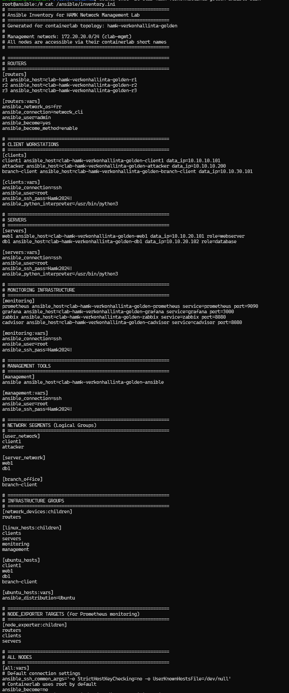
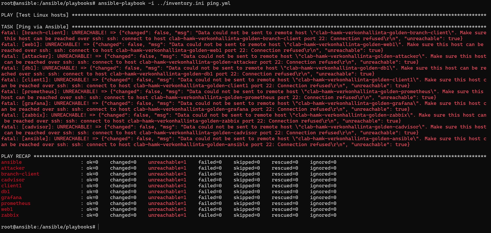

		Viikko 4

1. Johdanto

Infrastructure as Code (IaC) tarkoittaa infrastruktuuria koodina, ja se on menetelmä, jossa IT-infrastruktuuria 
(kuten palvelimia, verkkoja ja tietokantoja) hallitaan ja määritellään ohjelmoitavan koodin avulla manuaalisen työn sijasta. 

Tässä tehtävässä käytetään Ansiblea, joka on  on avoimen lähdekoodin IT-automaatio-, konfiguraationhallinta- ja ohjelmistojen 
käyttöönotto-työkalu.

2. Inventory

Inventory sisältää seuraavat laitteet ja ryhmät:

-routers
  *r1
  *r2
  *r3

-clients
  *client1
  *attacker
  *branch-client

-servers
  *web1
  *db1

(En ole varma luetaanko monitorointi ja hallinta laitteiksi, mutta listaan ne silti.)

-monitoring
  *prometheus
  *grafana
  *zabbix
  *cadvisor

-management
  *ansible

Em. ryhmien lisäksi inventoryyn kuuluu seuraavat ryhmät laitteineen (yksityiskohtaisempi kuvaus kts. kuva):

-user_network
-server_network
-branch_office
-linux_hosts
-ubuntu_hosts
-node_exporter

Ryhmien avulla playbookeja ja komentoja voidaan määrittää usealle laitteelle kerralla. 

3. Esimerkkiplaybookit

Komennolla ansible-playbook -i ../inventory.ini ping.yml playbook yrittää saada yhteyden hosteihin/laitteisiin, mutta ei tavoita yhtäkään.
Tuloksista voidaan päätellä, että ilmeisesti SSH-yhteys ei toimi. 

SNMP-playbookissa käytetään moduuleja apt, copy, service ja debug. Playbookissa hyödynnetään muuttujaa snmp_community arvolla public. Handlers-lohko 
käynnistää SNMP-ohjelman lopuksi uudestaan ja antaa tilailmoituksen "restarted" onnistuessaan.

Node Exporter-playbookissa käytetään moduuleja apt, file, get_url, unarchive, copy, shell, uri ja debug. Muuttuja node_exporter_version on 
asetettu arvoon 1.9.1. Node Exporter ei tarvitse handleria, koska käynnistys on toteutettu shell-moduulilla. 

4. Oma playbook (A)

---
- name: Update package cache and install nginx
  hosts: web1
  become: true

  tasks:
    - name: Update package cache
      apt:
        update_cache: yes

    - name: Install nginx
      apt:
        name: nginx
        state: present

    - name: Create index.html
      copy:
        dest: /var/www/html/index.html
        content: |
          <h1>Server: {{ inventory_hostname }}</h1>
      notify: restart nginx

    - name: Start nginx if not running
      shell: pgrep nginx || nginx
      changed_when: false

    - name: Verify web server
      uri:
        url: http://localhost
        status_code: 200

  handlers:
    - name: restart nginx
      shell: |
        nginx -s reload || nginx

PLAY [Update package cache and install nginx] ******************************************************************************************************

TASK [Update package cache] ************************************************************************************************************************
ok: [web1]

TASK [Install nginx] *******************************************************************************************************************************
ok: [web1]

TASK [Create index.html] ***************************************************************************************************************************
ok: [web1]

TASK [Start nginx if not running] ******************************************************************************************************************
ok: [web1]

TASK [Verify web server] ***************************************************************************************************************************
ok: [web1]

PLAY RECAP *****************************************************************************************************************************************
web1                       : ok=5    changed=0    unreachable=0    failed=0    skipped=0    rescued=0    ignored=0

5. Järjestelmätiedot

Käyttöjärjestelmä: Ubuntu

IP-osoite: 172.20.20.5

Prosessorien määrä: 12

Muistin määrä: 7796 MB

6. Yhteenveto

Käsin tehdyt asennukset eivät tuntuneet erityisesti hankalammilta tai työläämmiltä kun Ansiblella tehdyt asennukset. Erot tulevat ilmi vasta
kun asennusten määrää ruvetaan skaalaamaan ylös, jolloin automatisoidun asennuksen edut ovat selvät kun sama tehtävä pystytään suorittamaan 
kerralla kaikille valituille koneille ja esimerkiksi aiemmin määritetyille ryhmille. Automaatiosta tulee siis välttämätöntä siinä vaiheessa
kun ympäristöt kasvavat niin suuriksi, että kaiken asentaminen käsin veisi tolkuttoman paljon aikaa ja resursseja.

Playbookien tekeminen ja tulkitseminen on siinä mielessä hallittavampaa kun näkee koko komentoketjun ja prosessit kerralla, verrattuna käsin
asentamisen askel askeleelta lähestymistapaan. Toisaalta tuntuu, että siinäkin on etunsa kun virheet on helpompi korjata vaihe kerrallaan. 
