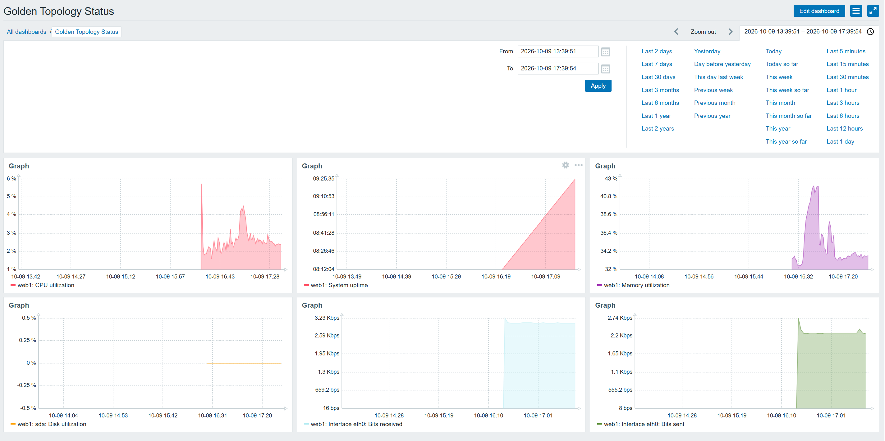
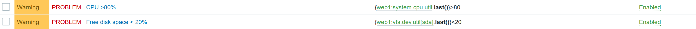

			Viikko 6

1. Johdanto

Zabbix on valvontaohjelmisto, jolla voidaan seurata mm. palvelimien, verkkolaitteiden ja palveluiden toimintaa. 
Sen avulla voidaan kerätä tietoa esimerkiksi prosessorin käytöstä, muistista, levytilasta, 
verkkoliikenteestä ja palveluiden tilasta. Zabbixilla voidaan myös tehdä graafeja, dashboardeja ja hälytyksiä.
Näin käyttäjä voi huomata ongelmat nopeasti ja nähdä yhdestä paikasta, miten eri laitteet toimivat.

Zabbix-käyttöliittymät osia:

- Hosts: Täällä näkyvät Zabbixiin lisätyt valvottavat laitteet.
- Templates: Valmiita valvonta-asetuksia, joita voidaan liittää hosteihin.
- Monitoring: Täältä voi seurata valvottavien laitteiden tietoja ja mahdollisia ongelmia.
- Dashboards: Näyttää valvonnan tärkeimpiä tietoja ja graafeja yhdessä näkymässä.
- Alerts: Täällä näkyvät valvonnan hälytykset ja niihin liittyvät asetukset.
- Reports: Täältä voidaan tarkastella raportteja valvonnan toiminnasta ja tapahtumista.

2. Hostien lisääminen

* web1

Lisäsin web1-palvelimen Zabbixiin hostiksi IP-osoitteella 172.20.20.8. Hostille määritin Zabbix agent
-liitännän porttiin 10050 ja liitin Linuxille tarkoitetun Zabbix agent -templaten.
Yhteys toimii ja web1 näkyy Zabbixissa vihreällä ZBX-tilalla.

* db1

Lisäsin db1-palvelimen Zabbixiin hostiksi IP-osoitteella 172.20.20.7. Hostiin liitin Linuxille tarkoitetun Zabbix
agent -templaten. Zabbix-agentti toimi ja mittareita alkoi tulla normaalisti. Tarkistin, että CPU, muisti, uptime ja
verkkoliikenne näkyvät Latest data -näkymässä.

* branch-client

Lisäsin branch-client-palvelimen Zabbixiin hostiksi IP-osoitteella 172.20.20.3 ja samalla templatella kuin web1 ja db1. 

Kaikki kolme laitetta näkyvät Zabbixissa.

3. Dashboard

4. Mittarit

Mittari				Arvo				Merkitys

CPU utilization			3.6898%				Kertoo prosessorin kuormituksen.

System uptime			09:34:05			Kertoo kuinka kauan järjestelmä on ollut käynnissä.

Memory utilization		33.9126 %			Kertoo paljonko muistia on käytössä.

Disk utilization		0%				Kertoo minkä verran levyä käytetään.

eth0: Bits received		3.06 Kbps			Kertoo paljonko verkkoliikennettä tulee sisään.

eth0: Bits sent			2.29 Kbps			Kertoo paljonko verkkoliikennettä lähtee ulos.

5. Triggerit

Triggeri 1:

- nimi: CPU > 80%
- ehto: {web1:system.cpu.util.last()}>80
- vakavuusluokka: Warning

Triggeri 2:

- nimi: Free disk space < 20%
- ehto: {web1:vfs.dev.util[sda].last()}<20
- vakavuusluokka: Warning

6. Hälytys- ja häiriötestit

CPU:ta kuormittamalla sain aikaan hälytyksen, mutta jostain syystä levy aiheutti hälytyksen vaikka en mitään
tehnytkään.

Pysäytin ensin Apachen komennolla:

service apache2 stop

Sen jälkeen pysäytin myös node_exporterin komennolla:

pkill node_exporter

Kummankaan pysäytyksen jälkeen Zabbixissa ei näkynyt selvää muutosta mittareissa eikä automaattista hälytystä syntynyt.

7. Vertailu

Ominaisuus		SNMP		Prometheus		Zabbix

Tiedonkeruu	   SNMP-agentit		node_exporter		agentit ja SNMP

Dashboardit	      ei omia		Grafana			ohjelmassa itsessään

Hälytykset	 erillinen ohjelma	Alertmanager		    -II-

Käyttöönotto	 helpoin näistä		vaatii enemmän säätöä	vaatii serverin ja agentin

Skaalautuvuus	      hyvä		hyvä			hyvä

Yrityskäyttö	  verkkolaitteet	palvelimet ja kontit	valvonta

8. Yhteenveto

Pohdinta:

1. Keskitetty valvonta kokoaa laitteiden tilanteen yhteen paikkaan.

2. Tärkeimpiä ovat CPU, muisti, levytila ja verkkoliikenne.

3. Hälytys pitäisi tulla laitevioista ja liian suuresta kuormasta.

4. Prometheusta käyttäisin paljon mittareita sisältävissä ympäristöissä.

5. Zabbixia käyttäisin yleiseen palvelin- ja verkkovalvontaan.

6. Lisäisin palveluiden ja yhteyksien tarkempaa valvontaa.

Kurssilla opin verkonhallinnan perusteita, kuten SNMP:n käyttöä, palvelimien ja verkkolaitteiden valvontaa, 
Prometheusta, Grafanaa, Ansiblea ja Zabbixia. Lisäksi opin automatisoimaan asennuksia ja seuraamaan verkon 
sekä palveluiden toimintaa eri työkaluilla.

